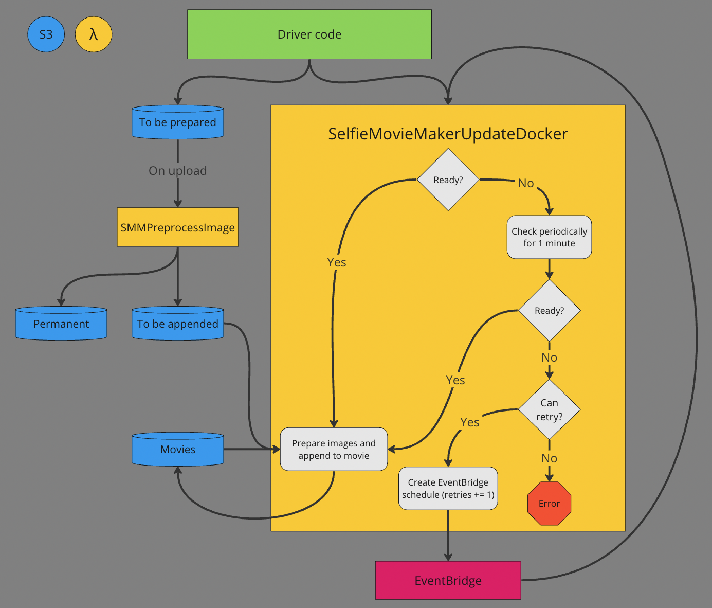

# Selfie Movie Maker

### Overview

I take a selfie of myself every day at 8:30pm. I write the date on each one and compile them into a movie so that I can see my life as a series of images. This app automates everything after taking the photo.

### Architecture

The infrastructure is comprised of 4 S3 buckets and 2 Lambda functions as listed below:

S3 buckets:

1. To be prepared
2. To be appended
3. Permanent images
4. Movies

Lambda functions:

1. Preprocess (uploaded as zip)
2. Process & append (Docker image stored in ECR)

The "driver code" (web app, script, user in AWS console, etc.) uploads images to bucket 1. These are images that are to be appended to a movie. Lambda 1 is invoked once per image, as the Lambda function is triggered by each upload to bucket 1. It downloads the image, reads the date EXIF metadata, and then uploads the image to both buckets 2 and 3 with the date as the key.

The driver code also invokes Lambda 2 at the same time as uploading the images. The driver code passes as part of the Lambda payload the number of images that were just uploaded to bucket 1. Lambda 2 checks that bucket 2 has that many images in it. If it does, it writes the date on each one (taken from object key) and appends them to the movie stored in bucket 4. If it doesn't, it polls bucket 2 for up to 1 minute. If at any point the correct number of images are present, it goes ahead with processing/appending. After one minute of polling, an EventBridge schedule is creating to re-invoke the function in 2 minutes. This new invocation will also contain a "retry count" (set to 1), which is used to cap the number of times that the function is retried. Each retry increases the retry count. After the maximum number of retries, an error is thrown.

### Local setup

There shouldn't be too much "local" setup, since there is a Github Codespace set up for this project.

In order to run `bin/update_ecr_and_lambda.sh`, the AWS CLI needs to be authenticated. Not yet sure how something like that is saved in the Codespace.

### Run locally

1. Build the Docker image: `docker build --platform linux/amd64 -t smm-dev:latest .`
2. Append an image to a movie: `./bin/run_local.sh {PATH_TO_INPUT_IMAGE} {PATH_TO_INPUT_MOVIE} {PATH_TO_OUTPUT_MOVIE}`

In order to debug the Docker container, you can remove the last line of `bin/run_local.sh`, which removes the Docker container. That way, it will still be running after the whole script executes.

### Other notes

- The AWS Lambda Python 3.10 runtime uses an older version of boto3 that does not let us (AFAIK) create an EventBridge schedule that deletes itself after its execution. As mentioned in `pyproject.toml` and the `Dockerfile`, we install our own version of `boto3` and `botocore` so that we have access to this feature.
- `ffmpeg.tar.xz` is downloaded from https://johnvansickle.com/ffmpeg/releases/ffmpeg-release-amd64-static.tar.xz
